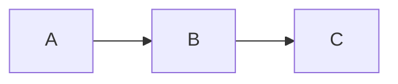

# Slidev 발표 자료 실행 가이드

## Mac

### 1. Node.js 설치 (없는 경우)

```bash
# Homebrew로 설치 (권장)
brew install node

# 또는 nvm으로 설치
curl -o- https://raw.githubusercontent.com/nvm-sh/nvm/v0.40.1/install.sh | bash
nvm install --lts
```

### 2. 프로젝트 세팅

```bash
# 프레젠테이션 디렉토리로 이동
cd docs/presentation

# Slidev 설치 + 실행 (npx는 별도 설치 불필요)
npx slidev
# 또는 파일명 명시
npx slidev slides.md
```

브라우저에서 자동으로 `http://localhost:3030` 이 열립니다.

### 3. 유용한 명령어

```bash
# 특정 포트로 실행
npx slidev --port 8080

# 발표자 모드 (별도 창)
# 브라우저에서 http://localhost:3030/presenter 접속

# PDF 내보내기 (Playwright 기반)
npx slidev export

# SPA로 빌드 (정적 호스팅용)
npx slidev build
```

### 4. 단축키 (발표 중)

| 키 | 동작 |
|----|------|
| `→` / `Space` | 다음 슬라이드 |
| `←` | 이전 슬라이드 |
| `o` | 슬라이드 개요 |
| `d` | 다크/라이트 토글 |
| `f` | 전체화면 |
| `g` | 특정 페이지로 이동 |

---

## Windows

### 1. Node.js 설치 (없는 경우)

**방법 A: 공식 설치 파일 (가장 간단)**

1. https://nodejs.org 에서 LTS 버전 다운로드
2. 설치 파일 실행 → 기본 옵션으로 설치
3. 설치 완료 후 터미널(PowerShell 또는 CMD) 재시작

**방법 B: winget (Windows 11)**

```powershell
winget install OpenJS.NodeJS.LTS
```

**방법 C: nvm-windows**

```powershell
# https://github.com/coreybutler/nvm-windows/releases 에서 설치
nvm install lts
nvm use lts
```

### 2. 설치 확인

```powershell
node --version    # v20.x.x 이상
npm --version     # 10.x.x 이상
```

### 3. 프로젝트 세팅

```powershell
# 프레젠테이션 디렉토리로 이동
cd docs\presentation

# Slidev 설치 + 실행
npx slidev
# 또는 파일명 명시
npx slidev slides.md
```

브라우저에서 자동으로 `http://localhost:3030` 이 열립니다.

### 4. PDF 내보내기

```powershell
npx slidev export
```

> PDF 내보내기 시 Playwright가 자동 설치됩니다. 첫 실행에 시간이 걸릴 수 있습니다.

---

## 공통 팁

### Mermaid 다이어그램 사용

slides.md 안에서 Mermaid 코드블록을 쓰면 Slidev가 자동 렌더링합니다:

````markdown

````

### 테마 변경

slides.md 상단 frontmatter에서 테마를 바꿀 수 있습니다:

```yaml
---
theme: seriph      # 현재 사용 중
# theme: default   # Slidev 기본
# theme: apple-basic
# theme: bricks
---
```

테마 목록: https://sli.dev/resources/theme-gallery

### 폰트 관련

현재 슬라이드는 Pretendard, Noto Serif KR 등 한글 폰트를 사용합니다.
인터넷이 연결된 환경에서는 자동으로 CDN에서 로드됩니다.

### 발표자 노트 추가

각 슬라이드 하단에 `<!-- 발표자 노트 -->` 형식으로 추가 가능합니다:

```markdown
---

# 슬라이드 제목

내용...

<!--
여기에 발표자 노트를 작성합니다.
발표자 모드(http://localhost:3030/presenter)에서만 보입니다.
-->
```

### 트러블슈팅

| 증상 | 해결 |
|------|------|
| `npx` 명령 못 찾음 | Node.js 재설치 또는 터미널 재시작 |
| 포트 3030 사용 중 | `--port 8080` 옵션 추가 |
| Mermaid 렌더링 안 됨 | `npm i @slidev/plugin-mermaid` 설치 |
| 한글 깨짐 | 브라우저 인코딩 확인 (UTF-8) |
| PDF 내보내기 실패 | `npx playwright install chromium` 실행 |
