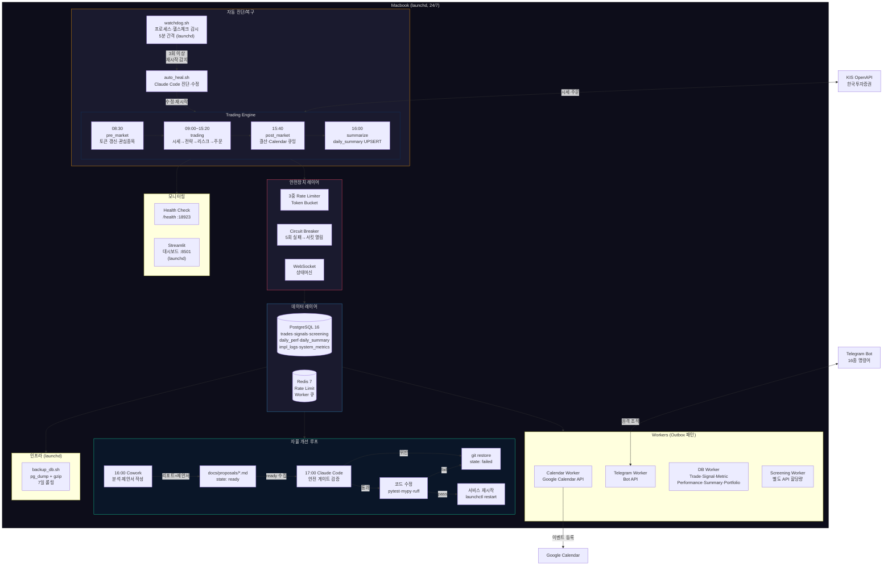
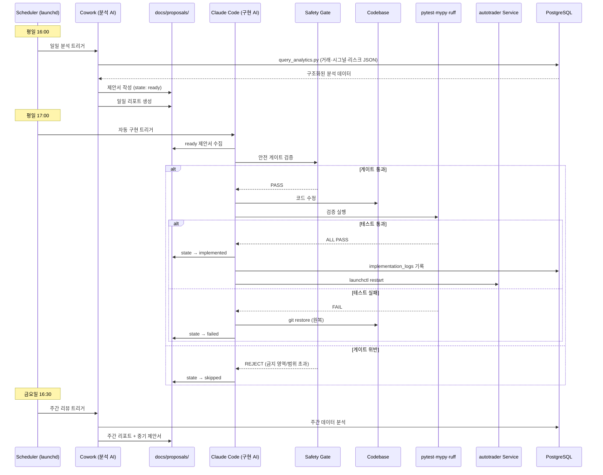
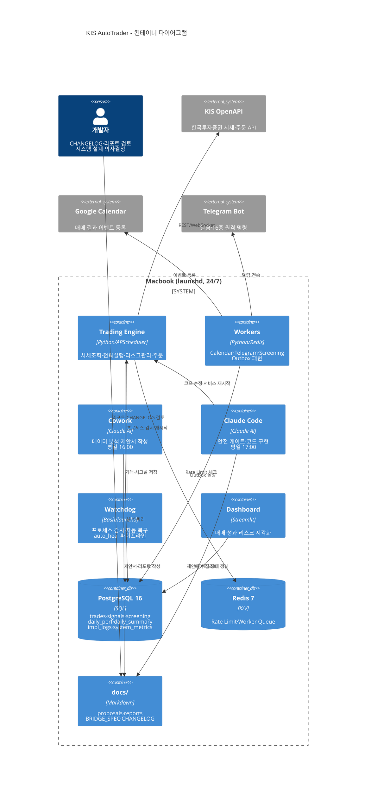

# 시스템 아키텍처 다이어그램 (Mermaid)

## 옵션 A: 전체 시스템 흐름도 (Flowchart)

Mermaid Live Editor (https://mermaid.live) 에 붙여넣으면 바로 렌더링됩니다.
Slidev에서는 코드블록 안에 `mermaid`로 감싸면 자동 렌더링됩니다.

---

## 옵션 B: 자율 개선 루프 시퀀스 다이어그램

---

## 옵션 C: C4 Model 스타일 (컨테이너 다이어그램)

